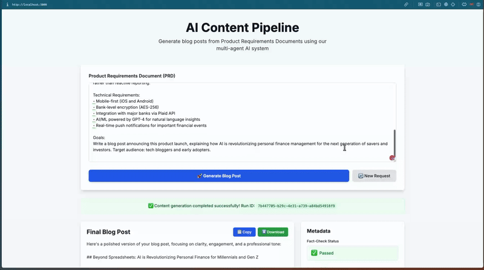

# AI Content Pipeline

[](LICENSE)



A multi-agent system that generates blog posts by coordinating four specialized AI agents through research, writing, fact-checking, and polishing stages.

## Why I Built This

I wanted to understand how to coordinate multiple AI agents in a pipeline where each one has a specific job. The interesting problem isn't "get an LLM to write a blog post" — it's building the orchestration layer that handles handoffs between agents, implements retry logic when the fact-checker catches errors, and maintains an audit trail of every decision.

## How It Works

```
                         ┌─────────────────┐
                         │   User Input    │
                         │  (PRD / Topic)  │
                         └────────┬────────┘
                                  │
                    ┌─────────────▼────────────────┐
                    │    Pipeline Orchestrator     │
                    │  (Coordinates all agents)    │
                    └─────────────┬────────────────┘
                                  │
        ┌─────────────────────────┼──────────────────────────┐
        │                         │                          │
┌───────▼────────┐      ┌────────▼────────┐      ┌─────────▼────────┐
│ RESEARCHER     │      │ WRITER          │      │ FACT-CHECKER     │
│                │──────►                 │──────►                  │
│ Extract topics │      │ Generate draft  │      │ Validate claims  │
│ via LLM, then  │      │ using research  │      │ against research │
│ search Tavily  │      │ as context      │      │ (triggers retry  │
│                │      │                 │      │  if issues found)│
└────────────────┘      └─────────────────┘      └──────────┬───────┘
                                                           │
                                                 ┌─────────▼────────┐
                                                 │ POLISHER         │
                                                 │                  │
                                                 │ Grammar, tone,   │
                                                 │ clarity fixes    │
                                                 │ (no fact changes)│
                                                 └─────────┬────────┘
                                                           │
                                                 ┌─────────▼────────┐
                                                 │  Final Output    │
                                                 └──────────────────┘
```

1. **Researcher** extracts 2-3 key topics from the PRD using Gemini, then queries Tavily for each topic
2. **Writer** receives the PRD + research context and generates an 800-1000 word draft
3. **Fact-Checker** compares the draft against research sources, flags unsupported claims
4. **Orchestrator** sends fact-check feedback back to Writer (max 2 retries) if issues are found
5. **Polisher** refines grammar and tone without changing factual content

Every agent action is logged to Supabase with timestamps, enabling full observability of the pipeline execution.

## 🔧 Key Technical Decisions

- **Tavily over raw Google results**: Tavily returns LLM-optimized summaries instead of raw HTML, which means the research context stays concise and the Writer agent doesn't hallucinate from noisy inputs.

- **Retry loop with ceiling**: The fact-checker triggers Writer revisions up to 2 times. Beyond that, I log a warning and proceed — sometimes the LLM just disagrees with itself about whether a claim is "supported," and blocking forever isn't practical.

- **Lazy Supabase initialization**: The client is initialized on first use rather than at import time. This prevents build failures when env vars aren't set (common in CI) and keeps the module side-effect free.

## 🛠️ Tech Stack

- Next.js 14 (App Router)
- TypeScript
- Google Gemini (configurable)
- Tavily API (web search)
- Supabase (PostgreSQL for logging)
- Tailwind CSS

## 🚀 Getting Started

```bash
git clone https://github.com/Ndhakeph/ai-content-pipeline
cd ai-content-pipeline
npm install

cp .env.local.example .env.local
# Add your keys to .env.local:
#   GOOGLE_API_KEY
#   TAVILY_API_KEY
#   NEXT_PUBLIC_SUPABASE_URL
#   NEXT_PUBLIC_SUPABASE_ANON_KEY
```

Set up the database in Supabase SQL Editor:

```sql
CREATE TABLE agent_logs (
  id UUID PRIMARY KEY DEFAULT uuid_generate_v4(),
  run_id UUID NOT NULL,
  agent_name TEXT NOT NULL,
  input_data TEXT,
  output_data TEXT,
  metadata JSONB,
  created_at TIMESTAMP DEFAULT NOW()
);

CREATE INDEX idx_agent_logs_run_id ON agent_logs(run_id);
```

Run locally:

```bash
npm run dev
# Open http://localhost:3000
```

## Project Structure

```
ai-content-pipeline/
├── app/
│   ├── api/generate/route.ts   # POST endpoint, runs the pipeline
│   ├── page.tsx                # Main UI with PRD input form
│   └── layout.tsx              # Root layout
├── lib/
│   ├── orchestrator.ts         # Pipeline coordination + retry logic
│   ├── agents.ts               # Researcher, Writer, Fact-Checker, Polisher
│   ├── gemini.ts               # Gemini API wrapper
│   ├── tavily.ts               # Tavily search wrapper
│   └── supabase.ts             # Logging client
├── components/
│   ├── ResultsDisplay.tsx      # Final post + metadata panel
│   └── Timeline.tsx            # Agent execution timeline
└── types/
    └── index.ts                # PipelineState interface
```

## What I Learned

The hardest part was deciding what to do when fact-checking fails repeatedly. My first instinct was to block publication entirely, but that's not practical — sometimes the LLM just disagrees with itself about whether a claim is "supported." I settled on logging a warning and proceeding after 2 retries. It's a tradeoff between quality guarantees and actually producing output. If I rebuilt this, I'd add a human review queue for posts that fail fact-checking instead of auto-publishing them with a warning. I also learned that choosing the right search API matters a lot — Tavily's LLM-optimized responses cut my prompt sizes in half compared to scraping raw search results.

## License

MIT
